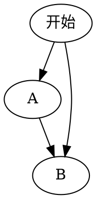

* content
{:toc}

# 这是一个测试

## 1.普通文字
hello, markdown!


## 2.latex公式
\[
e ^ {i\pi} + 1 = 0
\]


## 3.代码  `在tab键上方

```java
public class Test{
   System.out.print("Hello World");
}
```


## 4.图片
打开image-helper,上传图片


## 5.快捷键
1.ctrl+shift+m 对比\
2.ctrl+shift+x 显示latex公式


## 6.流程图


## 参考博客连接
1.https://sspai.com/post/40460
2.https://blog.csdn.net/u011583927/article/details/78858368#commentBox
3.插件使用连接：https://github.com/shd101wyy/markdown-preview-enhanced/blob/0.8.0/docs/README_CN.md
