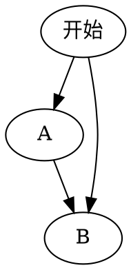

* content
{:toc}

# Markdown基本说明

## 1.普通文字

## hello, markdown!
### hello, markdown!
#### hello, markdown!
##### hello, markdown!
###### hello, markdown!

<font color=red>我是红色</font>
<font color=#008000>我是绿色</font>
<font face="STCAIYUN">我是华文彩云</font>
<font face="微软雅黑">我是微软雅黑</font>
<font size=5>我是尺寸</font>
<font face="黑体" color=green size=5>我是黑体，绿色，尺寸为5</font>
<table><tr><td bgcolor=yellow>背景色yellow</td></tr></table>


代码：
```md
## hello, markdown!
### hello, markdown!
#### hello, markdown!
##### hello, markdown!
###### hello, markdown!

<font color=red>我是红色</font>
<font color=#008000>我是绿色</font>
<font face="STCAIYUN">我是华文彩云</font>
<font face="微软雅黑">我是微软雅黑</font>
<font size=5>我是尺寸</font>
<font face="黑体" color=green size=5>我是黑体，绿色，尺寸为5</font>
<table><tr><td bgcolor=yellow>背景色yellow</td></tr></table>
```


## 2.Block Mathjax，公式编写
$$
e ^ {i\pi} + 1 = 0
$$


## 3.代码  `在tab键上方

```java
public class Test{
   System.out.print("Hello World");
}
```


## 4.图片
打开image-helper,上传图片


设置图片：
```


设置图片百分比


```

## 5.快捷键
1.ctrl+shift+m 对比\
2.ctrl+shift+x 显示latex公式


## 6.流程图


## 参考博客连接
1.https://sspai.com/post/40460
2.https://blog.csdn.net/u011583927/article/details/78858368#commentBox
3.插件使用连接：https://github.com/shd101wyy/markdown-preview-enhanced/blob/0.8.0/docs/README_CN.md
