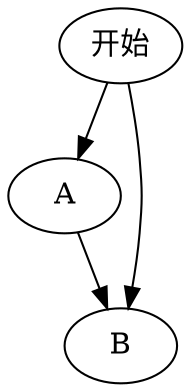

* content
{:toc}

# Markdown基本说明

## 1.普通文字

## hello, markdown!
### hello, markdown!
#### hello, markdown!
##### hello, markdown!
###### hello, markdown
**hello, markdown!
`markdown`

代码：
```md
## hello, markdown!
### hello, markdown!
#### hello, markdown!
**hello, markdown!
`markdown`
```


## 2.Block Mathjax，公式编写

Block Mathjax
$$
e ^ {i\pi} + 1 = 0
$$


## 3.代码  `在tab键上方

```java
public class Test{
   System.out.print("Hello World");
}
```


## 4.图片
打开image-helper,上传图片


<div align=right></div>

设置图片：
```


设置图片百分比


设置图片大小


设置图片居中
<div align=right></div>

```

## 5.快捷键
1.ctrl+shift+m 实时对比
2.ctrl+shift+p 上传图片


## 6.流程图


## 参考博客连接
1.https://sspai.com/post/40460

2.https://blog.csdn.net/u011583927/article/details/78858368#commentBox

3.插件使用连接：https://github.com/shd101wyy/markdown-preview-enhanced/blob/0.8.0/docs/README_CN.md
