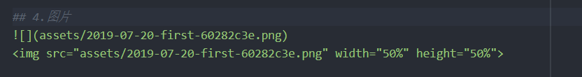

# Markdown基本说明

## 1.标题设置

## hello, markdown!
### hello, markdown!
#### hello, markdown!
##### hello, markdown!
###### hello, markdown
`markdown`

代码：
```md
## hello, markdown!
### hello, markdown!
#### hello, markdown!
**hello, markdown!
`markdown`
```


## 2.LaTex，公式编写
（1）行内公式
可以创建$e ^ {i\pi} + 1 = 0$行内公式
（2）块公式
$$e ^ {i\pi} + 1 = 0$$


## 3.代码块（ `在tab键上方）

```java
public class Test{
   System.out.print("Hello World");
}
```

## 4.图片
直接 ctrl+v 即可



## 5.表格
|Item    |Value   |Qty   |
|:----   |----:   |:----:|
|Computer|1600 USD|5     |
|Phone   |12 USD  |12    |
|Pipe    | 1 USD  |234   |

```
注：  (1) |:---     左对齐
      (2) ---:|     右对齐
      (3) |:---:|   居中
!!! 第二行必须注明对齐格式
```

## 6.脚注
```
文字内容[^1]
文章末尾 [^1]:
```
[^1]
[^2]
[^3]
[^4]

## 7. Atom快捷键
1.ctrl+shift+m 实时对比


## 参考博客连接
[^1]:https://sspai.com/post/40460
[^2]:https://blog.csdn.net/u011583927/article/details/78858368#commentBox
[^3]:插件使用连接：https://github.com/shd101wyy/markdown-preview-enhanced/blob/0.8.0/docs/README_CN.md
[^4]:https://www.jianshu.com/p/c6aa2f35d5ae
